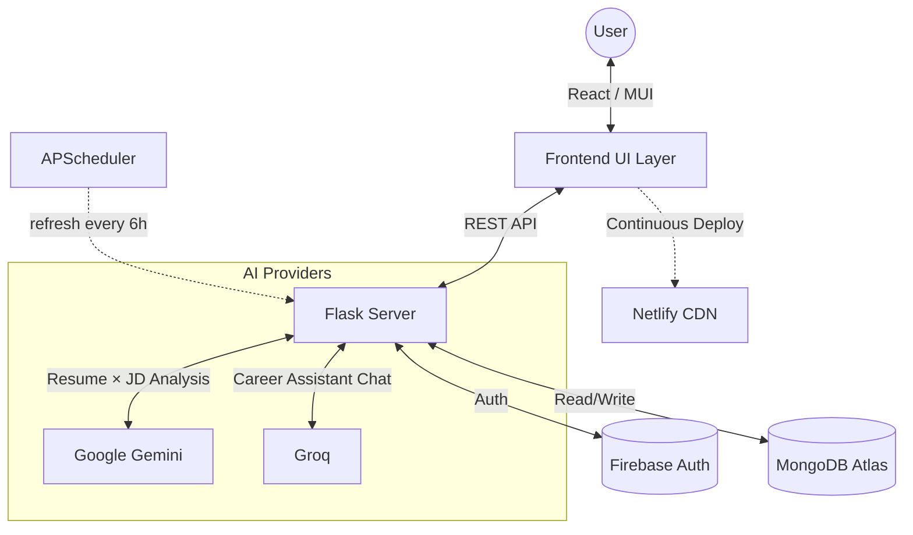
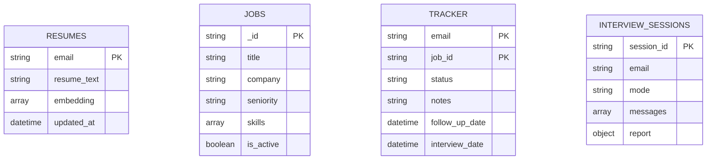
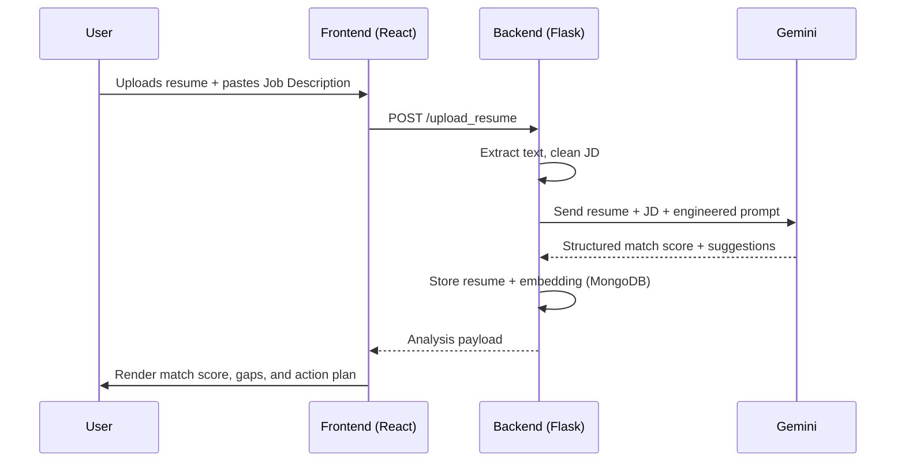

<a id="top"></a>
<div align="center">

# <span style="color: #10b981;">CareerPilot 🧭</span>
### <span style="color: #10b981;">*Your AI Co-Pilot for the Job Hunt*</span>

---

[](https://react.dev/)
[](https://flask.palletsprojects.com/)
[](https://ai.google.dev/)
[-0ea5e9?style=for-the-badge&logo=meta&logoColor=white)](https://groq.com/)
[](https://www.mongodb.com/atlas)
[](https://firebase.google.com/)

**Bridging the gap between your resume and your dream job — with AI that reads both like a recruiter would.**

<br/>

### 🚀 [**LAUNCH CAREERPILOT →**](https://spontaneous-kangaroo-4b0450.netlify.app/)

[](https://spontaneous-kangaroo-4b0450.netlify.app/)

</div>

---

### 📑 Table of Contents

* [🧭 Overview](#overview)
* [🎯 Why CareerPilot?](#why-careerpilot)
* [✨ Key Features](#key-features)
* [💻 Technology Stack](#technology-stack)
* [🏗️ System Architecture](#system-architecture)
* [🔄 Request Flow — Resume Analysis](#request-flow)
* [🖼️ Screenshots](#screenshots)
* [🧩 Feature Deep Dive](#feature-deep-dive)
* [🗺️ User Journey](#user-journey)
* [🔌 API Reference](#api-reference)
* [🗂️ Project Structure](#project-structure)
* [⚙️ Developer Setup](#developer-setup)
* [🎨 Design Notes](#design-notes)
* [🔮 Future Outcomes & Roadmap](#roadmap)
* [🤝 Contributing](#contributing)
* [📜 License](#license)

<div align="center">

[⬇ Jump to bottom](#bottom)

</div>

---

<a id="overview"></a>
## 🧭 Overview

**CareerPilot** is a full-stack, AI-powered platform built to solve one specific problem: most job seekers get rejected at the screening stage not because they lack the skills, but because their resume never speaks the job description's language in the first place.

CareerPilot closes that gap. Upload a resume, paste a job description, and within seconds get a match score, a section-by-section breakdown of what's working and what isn't, and a concrete action plan — missing skills, suggested courses, and projects worth adding. Beyond the one-time analysis, it becomes a full career companion: a job search engine matched to your resume, an application tracker with follow-up reminders, mock interview practice, and an AI Career Assistant that already knows your resume and your job history when you ask it a question.

> *"Most people don't lose the job in the interview. They lose it three seconds into the resume screen, before a human ever reads a word."* — the whole reason this exists.

<div align="right"><a href="#top">⬆ Back to top</a></div>

---

<a id="why-careerpilot"></a>
## 🎯 Why CareerPilot?

| Area | Traditional Approach | 🧭 CareerPilot |
| :--- | :--- | :--- |
| **Resume feedback** | Guesswork, or a senior's one-off opinion | AI match score against the *exact* job description |
| **Job search** | Separate tabs, separate sites | Matched listings inside the same dashboard |
| **Application tracking** | Spreadsheet you forget to update | Built-in tracker with auto follow-up reminders |
| **Interview prep** | Generic question banks | Mock interviews grounded in your actual resume |
| **Career guidance** | Search engine + hope | Context-aware AI chat that knows your data |

<div align="right"><a href="#top">⬆ Back to top</a></div>

---

<a id="key-features"></a>
## ✨ Key Features

| 🛠️ Feature | 📝 Description |
| :--- | :--- |
| **📄 Resume–JD Analysis** | Deep, section-by-section AI comparison of resume vs. job description, with a computed match score. |
| **🎯 Skill Gap Detection** | Highlights matched and missing skills, with course and project suggestions to close the gap. |
| **📊 Report Records** | Every past analysis saved and revisitable — track how your resume improves over time. |
| **💼 Job Search** | Live job listings, filterable by keyword and seniority, plus a "Best matches for you" mode ranked against your resume. |
| **📌 My Jobs Tracker** | Saved / Applied / Interviewing / Rejected / Offer pipeline, with notes, interview scheduling, and auto follow-up reminders. |
| **🎤 Interview Prep** | AI-driven mock interview sessions with a post-session performance report. |
| **📄 PDF Reports** | Download your resume analysis as a polished PDF — for offline reference or sharing. |
| **💬 Career Assistant** | A Groq-powered chatbot grounded in your resume and job activity — answers "what should I do next?" with real context. |
| **🌓 Light / Dark Mode** | Full theme system across the entire app, persisted per user. |
| **🔒 Secure Auth** | Firebase Authentication (Email/Password + Google) with protected routes. |
| **🧑‍✈️ Guided First Visit** | An in-app tour bot walks brand-new users through the platform on their very first Home load. |

<div align="right"><a href="#top">⬆ Back to top</a></div>

---

<a id="technology-stack"></a>
## 💻 Technology Stack

| Layer | Technology | Purpose |
| :--- | :--- | :--- |
| **Frontend** |  | Component-driven, responsive UI. |
| **UI Library** |  | Design system, theming (light/dark), and layout primitives. |
| **Backend** |  | REST API, request routing, and orchestration logic. |
| **Resume Analysis AI** |  | Section-by-section resume ↔ job description comparison. |
| **Career Assistant AI** |  | Ultra-low-latency inference for the in-app chat assistant. |
| **Database** |  | Cloud-hosted storage for resumes, jobs, tracker, and sessions. |
| **Authentication** |  | Email/password + Google sign-in, protected routing. |
| **Scheduling** |  | Periodic job-board refresh and stale-listing cleanup. |
| **Hosting** |  | Continuous deploys straight from `main`. |
| **Language** |   | Backend orchestration + frontend logic. |

<div align="right"><a href="#top">⬆ Back to top</a></div>

---

<a id="system-architecture"></a>
## 🏗️ System Architecture

CareerPilot follows a decoupled **Client–Server architecture**, with two independent AI providers handling distinct responsibilities — Gemini for deep document analysis, Groq for fast conversational inference.



### 🗄️ Data Model (MongoDB Collections)



<div align="right"><a href="#top">⬆ Back to top</a></div>

---

<a id="request-flow"></a>
## 🔄 Request Flow — Resume Analysis



<div align="right"><a href="#top">⬆ Back to top</a></div>

---

<a id="screenshots"></a>
## 🖼️ Screenshots

<div align="center">

### 🏠 Home &nbsp;·&nbsp; 🔑 Login &nbsp;·&nbsp; 📝 Sign Up

| Home | Login | Sign Up |
| :---: | :---: | :---: |
|  |  |  |

<br/>

### 📊 Dashboard &nbsp;·&nbsp; 📤 Upload &nbsp;·&nbsp; 📈 Result &nbsp;·&nbsp; 🗂️ Records

| Dashboard | Upload | Result Analysis | Records |
| :---: | :---: | :---: | :---: |
|  |  |  |  |

<br/>

### 💼 Job Search &nbsp;·&nbsp; 📌 My Jobs

| Job Search | My Jobs |
| :---: | :---: |
|  |  |

<br/>

### 🎤 Interview Prep


</div>

<div align="right"><a href="#top">⬆ Back to top</a></div>

---

<a id="feature-deep-dive"></a>
## 🧩 Feature Deep Dive

### 📄 Resume–JD Analysis
Gemini performs a section-by-section comparison of the uploaded resume against the pasted job description — Education, Skills, Projects, and Experience are each scored individually, then rolled into an overall match percentage. The output includes matched skills, missing skills, and concrete suggestions (courses to take, projects to build) to close the gap.

### 💼 Job Search & Matching
Live job listings are fetched and classified by seniority (junior / mid / senior) with extracted skill tags. A "Best matches for you" mode re-ranks the same listings against your stored resume embedding, so the jobs at the top are the ones you're most likely to get shortlisted for.

### 📌 My Jobs — Application Tracker
Every job you Save or Apply to lands here, organized into **Saved → Applied → Interviewing → Rejected → Offer** stages. Moving a job to *Applied* automatically schedules a 7-day follow-up reminder (adjustable or removable); moving it to *Interviewing* opens a quick dialog to log the interview date and prep notes. Free-text notes autosave on blur.

### 🎤 Interview Prep
A guided mock-interview session — either grounded in a specific job's context or a custom topic — that asks a sequence of questions, accepts typed or transcribed voice answers, and ends with an AI-generated performance report.

### 💬 Career Assistant
A persistent chat widget (powered by Groq for near-instant responses) that's automatically grounded in your resume text and tracked job data — so "what should I do next?" gets a real, personalized answer instead of a generic one.

### 🧑‍✈️ Guided First Visit
A conversational tour bot greets first-time visitors on Home, answers "what is this?" / "how does it work?" in a couple of clicks, and can scroll or deep-link straight into the relevant section or the sign-up flow — no forced walkthrough, dismissible any time.

<div align="right"><a href="#top">⬆ Back to top</a></div>

---

<a id="user-journey"></a>
## 🗺️ User Journey

| Stage | User Goal | Touchpoint |
| :--- | :--- | :--- |
| **1. Discovery** | Understand the value prop | Landing Page hero + feature sections |
| **2. Entry** | Create an account | Sign Up (email or Google) |
| **3. Upload** | Get the first analysis | Upload page (resume + JD) |
| **4. Insight** | Understand the gaps | Result page — match score & suggestions |
| **5. Action** | Find & track relevant roles | Job Search → My Jobs |
| **6. Preparation** | Get interview-ready | Interview Prep mock sessions |
| **7. Guidance** | Ask "what next?" anytime | Career Assistant chat |

<div align="right"><a href="#top">⬆ Back to top</a></div>

---

<a id="api-reference"></a>
## 🔌 API Reference

| Method | Endpoint | Description |
| :--- | :--- | :--- |
| `POST` | `/upload_resume` | Upload resume + JD, get AI analysis. |
| `GET` | `/api/jobs` | List jobs, filterable by keyword/seniority. |
| `GET` | `/api/jobs/matches` | Jobs ranked against the user's resume. |
| `POST` | `/api/tracker` | Save/update a job's tracker status. |
| `GET` | `/api/tracker` | Fetch tracked jobs for a status tab. |
| `GET` | `/api/tracker/status` | Lightweight `{job_id: status}` map for a user. |
| `PATCH` | `/api/tracker/<job_id>/notes` | Save a note on a tracked job. |
| `PATCH` | `/api/tracker/<job_id>/interview` | Save interview date/notes. |
| `PATCH` | `/api/tracker/<job_id>/followup` | Adjust or clear the follow-up reminder. |
| `DELETE` | `/api/tracker/<job_id>` | Remove a tracked job. |
| `POST` | `/api/interview/start` | Begin a mock interview session. |
| `POST` | `/api/interview/<id>/answer` | Submit an answer, get the next question. |
| `GET` | `/api/interview/<id>/report` | Fetch the final performance report. |
| `POST` | `/api/assistant/chat` | Chat with the Career Assistant. |
| `GET` | `/api/guide/status` | Fetch onboarding checklist progress for a user. |

<div align="right"><a href="#top">⬆ Back to top</a></div>

---

<a id="project-structure"></a>
## 🗂️ Project Structure

```
careerpilot-ai/
│
├── client/
│   └── src/
│       ├── pages/          # Welcome, Login, Signup, Upload, Result, Records,
│       │                   # JobSearch, MyJobs, About, FAQPage, CreatorDeskPage
│       ├── components/     # Navbar, Logo, HomeGuide, TourGuideBot, etc.
│       ├── theme/          # Light/dark theme system (ThemeContext.js)
│       └── firebase.js
│
├── backend/
│   ├── app.py               # Flask entry point & all routes
│   ├── tracker_store.py     # Job tracker persistence logic
│   ├── job_store.py         # Job listings storage
│   ├── job_fetcher.py       # External job board ingestion
│   ├── job_classifier.py    # Seniority + skill extraction
│   ├── match_score.py       # Resume ↔ job embedding similarity
│   ├── interview_engine.py  # Mock interview session logic
│   ├── assistant_engine.py  # Career Assistant (Groq) logic
│   └── LLMHandler.py        # Gemini analysis + embeddings
│
├── netlify.toml
└── README.md
```

<div align="right"><a href="#top">⬆ Back to top</a></div>

---

<a id="developer-setup"></a>
## ⚙️ Developer Setup

### Prerequisites
- **Node.js 18+**
- **Python 3.9+**
- **MongoDB Atlas** connection URI
- **Firebase** project (Auth enabled)
- **Google Gemini API key**
- **Groq API key**

### 1. Clone the repository
```bash
git clone https://github.com/Ankita-Kumari0309/careerpilot-ai.git
cd careerpilot-ai
```

### 2. Backend setup
```bash
cd backend
python -m venv venv
# Mac/Linux
source venv/bin/activate
# Windows
venv\Scripts\activate

pip install -r requirements.txt
```

Create a `.env` file inside `/backend`:
```
MONGO_URI=your_mongodb_atlas_uri
GEMINI_API_KEY=your_gemini_api_key
GROQ_API_KEY=your_groq_api_key
```

Run the backend:
```bash
python app.py
```

### 3. Frontend setup
```bash
cd ../client
npm install
```

Create a `.env` in `/client`:
```
REACT_APP_API_BASE=http://127.0.0.1:5000
```

Run the frontend:
```bash
npm start
```

The frontend runs on `http://localhost:3000`, backend on `http://127.0.0.1:5000`.

<div align="right"><a href="#top">⬆ Back to top</a></div>

---

<a id="design-notes"></a>
## 🎨 Design Notes

CareerPilot runs on a **teal → emerald → sky** palette instead of the more common indigo/purple SaaS look — a deliberate choice to feel calmer and more "clarity-focused" for something people use while stressed about job hunting. The whole system is theme-token driven (`src/theme/ThemeContext.js`): one file controls primary/secondary colors, glass-morphism surfaces, glow gradients, and chip styling across every page in both light and dark mode, so the entire app re-themes from a single source of truth.

<div align="right"><a href="#top">⬆ Back to top</a></div>

---

<a id="roadmap"></a>
## 🔮 Future Outcomes & Roadmap

CareerPilot is evolving from a resume analyzer into a complete AI-driven placement companion. Planned directions:

### 🛠️ Near-term
- [ ] Persistent chat history for the Career Assistant (currently resets on refresh).
- [ ] Full onboarding tour across every authenticated page, not just Home.
- [ ] Multi-resume support with version history, so users can maintain resumes for different roles.
- [ ] Smarter, editable follow-up scheduling based on company response patterns.

### 🧠 Mid-term
- [ ] Inline resume rewriting — AI edits the resume directly instead of only describing changes.
- [ ] Browser extension to analyze any job posting in one click, from any site.
- [ ] Mock interview voice mode with real-time speech feedback (tone, pacing, filler words).
- [ ] LinkedIn/Naukri-style one-click apply integration from the Job Search tab.

### 📊 Long-term
- [ ] Application funnel analytics — conversion rates across saved → applied → interview → offer.
- [ ] Placement-cell / institution dashboards for tracking student outcomes at scale.
- [ ] Predictive skill-gap alerts based on trending job market data.
- [ ] Peer benchmarking — see how your resume match score compares anonymously to others applying for similar roles.

<div align="right"><a href="#top">⬆ Back to top</a></div>

---

<a id="contributing"></a>
## 🤝 Contributing

Contributions are what make the open-source community such an amazing place to learn, inspire, and create. Any contributions you make are **greatly appreciated**.

1. Fork the project
2. Create your feature branch (`git checkout -b feature/AmazingFeature`)
3. Commit your changes (`git commit -m 'feat: add AmazingFeature'`)
4. Push to the branch (`git push origin feature/AmazingFeature`)
5. Open a Pull Request

<div align="right"><a href="#top">⬆ Back to top</a></div>

---

<a id="license"></a>
## 📜 License

Distributed under the MIT License. See `LICENSE` for details.

---

### 👤 Author

**Ankita Kumari**

[](https://www.linkedin.com/in/ankita-kumari-59960a285/)

<a id="bottom"></a>
<div align="center">

**If CareerPilot helped you, consider giving the repo a ⭐ — it means a lot!**

[⬆ Back to top](#top)

</div>
